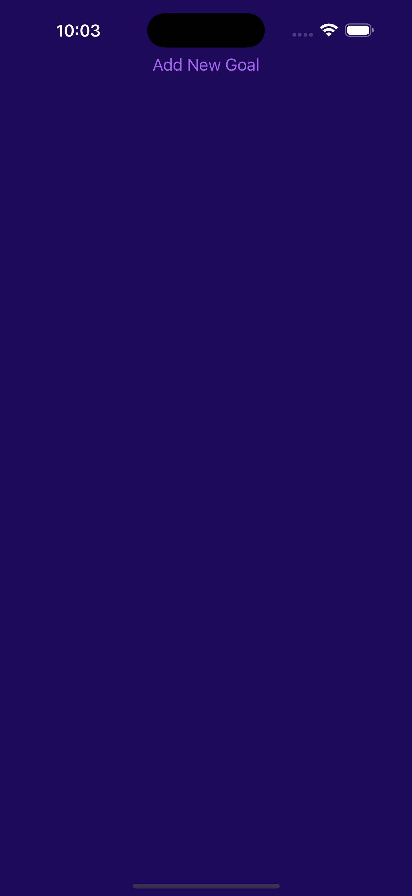

# React Native Todo List - Goal Tracker App 

A simple React Native app built using **Expo** that allows users to:

- Add personal goals.
- View goals in a list.
- Tap a goal to remove it.

---

## Features

- Built using **React Native + JavaScript** with **npx expo**
- Modal-based goal input system
- Tap-to-remove goals
- Clean and minimal UI with custom colors and styling

---

## Demo

| Home Screen            | Add Goal Modal        | Goal Displayed         |
|------------------------|-----------------------|------------------------|
|  |  |  |

---

## Technologies Used

- [React Native](https://reactnative.dev/)
- [Expo](https://expo.dev/)
- JavaScript

---

## How to Run

1. Clone the repository:

2. Install dependencies:

3. Start the app with Expo:

4. Open it in:

   - iOS Simulator
   - Android Emulator
   - Expo Go app on your device

---

## 📄 License

This project is licensed under the MIT License.